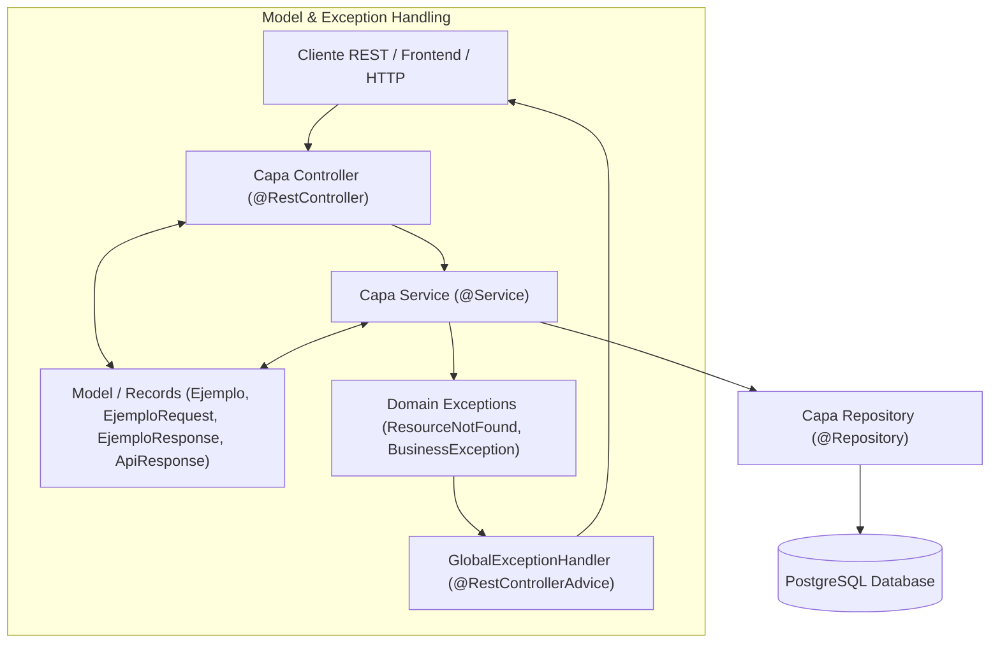

# Guía de Arquitectura y Desarrollo Senior — Spring Boot Template

Bienvenido a la guía técnica oficial para desarrolladores senior de la plataforma Infosystem. Este documento establece los patrones de diseño, principios arquitectónicos, normas de código y flujos de automatización que rigen los microservicios y backends creados a partir de `core-springboot-template`.

---

## 1. Visión General de Arquitectura

El objetivo fundamental de esta plantilla es proveer una arquitectura de referencia limpia, de alto rendimiento, mantenible y con **documentación viva generada automáticamente desde el código**.

### Stack Tecnológico y Dependencias Maven

- **JDK / Java:** Java 17 LTS (`<java.version>17</java.version>`, `<maven.compiler.release>17</maven.compiler.release>`).
- **Spring Boot:** 4.1.0 (`spring-boot-starter-parent`).
- **Web & Validaciones:** `spring-boot-starter-web`, `spring-boot-starter-validation` (Jakarta Validation).
- **Persistencia:** PostgreSQL (`postgresql`) + Spring JDBC (`spring-boot-starter-jdbc`) + Flyway DDL (`flyway-database-postgresql`).
- **Seguridad & JWT:** Spring Security (`spring-boot-starter-security`) + Auth0 JWT (`java-jwt` v4.4.0).
- **Cliente API Core (Opcional):** `com.infosystem:core-api-client:1.0.7` vía GitHub Packages (`https://maven.pkg.github.com/gutierrezcarlos510/core-api-client`).
  - Plantillas de clase pre-configuradas (comentadas sin impacto en runtime hasta activarlas):
    - [`config/CoreClientConfig.java`](./java/core-springboot-template/templates/project/config/CoreClientConfig.java.template) — Bean `CoreUsuarioClient`.
    - [`service/CoreIntegrationService.java`](./java/core-springboot-template/templates/project/service/CoreIntegrationService.java.template) — Métodos de integración con `core-backend` (verificación de contacto, autoprovisión y manejo de `CoreException`).
- **Documentación OpenAPI:** Springdoc OpenAPI UI (`springdoc-openapi-starter-webmvc-ui` v2.8.5).
- **Herramientas:** Project Lombok (`lombok` v1.18.36).
- **Pruebas:** `spring-boot-starter-test`, `spring-security-test`.
- **Herramientas de Scaffolding & CI:** Node.js (scripts de contrato y exportación).

---

## 2. Arquitectura por Capas (Layered Architecture)

Cada backend sigue una estricta separación de responsabilidades dividida en 4 capas horizontales:



### 2.1 Capa Controller (`controller/`)

- **Responsabilidad:** Exponer la API RESTful, gestionar los códigos de respuesta HTTP, validar la entrada (`@Valid`) y mapear la documentación OpenAPI (`@Operation`, `@Tag`, `@Parameter`).
- **Regla:** Ningún controlador debe ejecutar lógica de negocio ni comunicarse directamente con el repositorio de datos o la base de datos.

### 2.2 Capa Service (`service/`)

- **Responsabilidad:** Implementar las reglas de negocio, coordinar transacciones (`@Transactional`), realizar validaciones complejas de dominio y convertir modelos a respuestas DTO.
- **Manejo de Transacciones:**
  - La clase se declara con `@Transactional(readOnly = true)` por defecto para optimizar lecturas.
  - Los métodos de escritura (crear, actualizar, eliminar) se anotan explícitamente con `@Transactional`.
- **Excepciones:** Cuando una regla de negocio se viola o un elemento no existe, el servicio lanza excepciones de dominio (`ResourceNotFoundException`, `BusinessException`).

### 2.3 Capa Repository (`repository/`)

- **Responsabilidad:** Ejecutar operaciones de persistencia en PostgreSQL mediante Spring `JdbcClient`.
- **¿Por qué `JdbcClient` en lugar de ORMs tradicionales (JPA/Hibernate)?:**
  1. **Control total y rendimiento:** Cero problemas de N+1 queries o lazy loading inesperado.
  2. **Consultas legibles:** SQL nativo utilizando Text Blocks multilínea Java 17 (`"""..."""`).
  3. **Seguridad:** Parámetros con nombre (`:paramName`) para prevenir inyección SQL.
  4. **Mapeo explícito:** Funciones `RowMapper` deterministas que convierten `ResultSet` en objetos Java inmutables.

### 2.4 Capa Model (`model/`)

Al igual que en `core-backend`, **no existe una carpeta `dto` separada**. Todo el modelo de datos y contratos REST residen dentro del paquete `model/`:

- **Modelos de Dominio:** Entidades internas (Java Records o POJOs).
- **Contratos REST / DTOs:**
  - `*Request`: Contiene validaciones Jakarta (`@NotBlank`, `@Size`, `@Pattern`) y anotaciones Swagger (`@Schema`).
  - `*Response`: Representa la respuesta enviada al cliente, anotada con `@Schema`.
  - `ApiResponse<T>`: Envelope universal de respuesta REST.

---

## 3. Estándar REST y Manejo de Excepciones

### 3.1 Formato Unificado de Respuesta (`ApiResponse<T>`)

Toda respuesta de la API (tanto exitosa como con fallas) responde con la estructura normalizada:

```json
{
  "success": true,
  "message": "Operación realizada con éxito",
  "data": { ... },
  "timestamp": "2026-09-17T20:00:00Z",
  "error": null
}
```

Estructura de error:

```json
{
  "success": false,
  "message": "Error de validación en la solicitud",
  "data": null,
  "timestamp": "2026-09-17T20:00:00Z",
  "error": {
    "code": "VALIDATION_FAILED",
    "details": [
      "El nombre es obligatorio",
      "El estado debe ser ACTIVO o INACTIVO"
    ]
  }
}
```

### 3.2 Mapeo de Excepciones (`GlobalExceptionHandler`)

| Excepción                         | Código HTTP                 | Código Error (`ApiResponse`) | Razón                                            |
| --------------------------------- | --------------------------- | ---------------------------- | ------------------------------------------------ |
| `ResourceNotFoundException`       | `404 NOT FOUND`             | `RESOURCE_NOT_FOUND`         | El UUID o recurso consultado no existe.          |
| `BusinessException`               | `400 BAD REQUEST`           | `BUSINESS_RULE_VIOLATION`    | Regla de negocio violada (ej: nombre duplicado). |
| `MethodArgumentNotValidException` | `400 BAD REQUEST`           | `VALIDATION_FAILED`          | Fallaron anotaciones `@Valid` en `@RequestBody`. |
| `DataAccessException`             | `500 INTERNAL_SERVER_ERROR` | `DATABASE_ERROR`             | Fallo de conexión o restricción SQL.             |
| `Exception`                       | `500 INTERNAL_SERVER_ERROR` | `INTERNAL_SERVER_ERROR`      | Error no capturado / imprevisto.                 |

---

## 4. Base de Datos y Migraciones con Flyway

### 4.1 Normas de Migración SQL

- Cada cambio en la base de datos requiere una nueva migración en `src/main/resources/db/migration/V{timestamp}__{descripcion}.sql` o `V{N}__{descripcion}.sql`.
- **Nunca modificar una migración que ya fue aplicada** en entornos compartidos o producción.

### 4.2 Auto-Documentación de Esquema con `COMMENT ON`

El script extractor de documentación (`export-db-schema.mjs`) inspecciona la base de datos y extrae los comentarios SQL para generar `docs/database/{service}-schema.md`.

**Regla estricta:** Toda tabla y columna nueva DEBE incluir comentarios SQL:

```sql
CREATE TABLE productos (
    id          UUID PRIMARY KEY DEFAULT gen_random_uuid(),
    nombre      VARCHAR(150) NOT NULL,
    precio      NUMERIC(12, 2) NOT NULL,
    created_at  TIMESTAMPTZ DEFAULT CURRENT_TIMESTAMP NOT NULL
);

COMMENT ON TABLE productos IS 'Tabla de catálogo de productos ofertados.';
COMMENT ON COLUMN productos.id IS 'Identificador único UUID del producto.';
COMMENT ON COLUMN productos.nombre IS 'Nombre comercial del producto.';
COMMENT ON COLUMN productos.precio IS 'Precio unitario en la moneda local.';
COMMENT ON COLUMN productos.precio IS 'Fecha y hora de creación.';
```

---

## 5. Contrato con `core-backend` (`public.core_v_*`)

Para mantener el desacoplamiento entre microservicios:

1. **Prohibido:** Consultar directamente las tablas físicas del esquema `public` de `core-backend`.
2. **Permitido:** Consultar únicamente las vistas públicas publicadas por core: `public.core_v_*`.
3. **Declaración:** Registrar todas las vistas y columnas requeridas en `db-contract.json`.
4. **Verificación CI:** El test de integración `DbContractTest` valida en cada pipeline de CI que las vistas sigan existiendo y conserven los tipos de datos declarados.

---

## 6. Automatización de Comandos (CLI & Scaffolding)

### 6.1 Crear un Nuevo Backend

Para arrancar un nuevo microservicio completo con todas sus capas, configuración de seguridad, migraciones y scripts:

```bash
npm run scaffold -- --service FARMACIA --package com.infosystem.farmacia --out ../farmacia-backend
```

### 6.2 Crear un Nuevo Módulo CRUD

Para agregar una nueva entidad completa (Controller, Service, Repository, DTOs, Model y Migración Flyway) dentro de un backend existente:

```bash
npm run scaffold:module -- --name Producto --table productos
```

### 6.3 Flujo de Trabajo y Documentación Viva

Ejecutar antes de realizar commits que alteren APIs o tablas:

```bash
npm run export:endpoints -- --service MI_SERVICIO   # Genera docs/endpoints/{service}-endpoints.json
mvn test -Dtest=OpenApiExportTest                   # Genera docs/openapi/{service}-openapi.json
npm run export:schema -- --service MI_SERVICIO      # Genera docs/database/{service}-schema.md
```

---

## 7. Buenas Prácticas de Pruebas y Calidad de Código

1. **Pruebas Unitarias:** Probar la capa de servicios mockeando el repositorio (`@ExtendWith(MockitoExtension.class)`).
2. **Pruebas de Integración:** Verificar repositorios contra instancias de Postgres locales o contenedores de prueba Testcontainers.
3. **Cobertura y Complejidad:**
   - Mantener cobertura de pruebas > 80%.
   - Mantener la complejidad ciclomática < 10 por método.
   - Nombres descriptivos de variables y métodos en español o inglés consistente.
